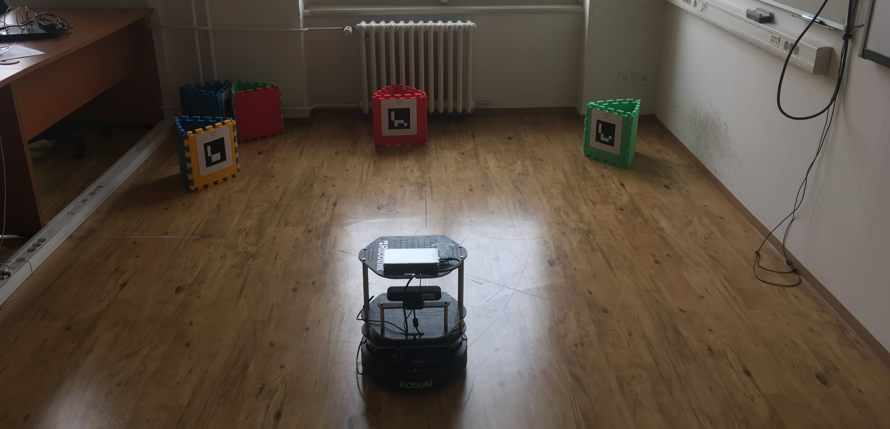
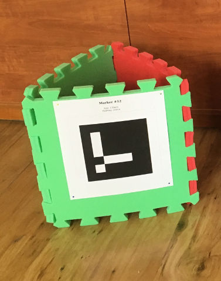
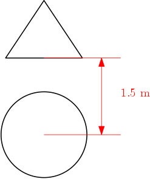

# b3m33aro: Autonomous Robotics

This repository contains material for the final project of the Autonomus Robotics ([B3M33ARO](https://www.fel.cvut.cz/en/education/bk/predmety/46/81/p4681906.html)).

# Assignment

The task is to implement a program for the robot, so that it autonomously goes through the race course. The course is given by checkpoints that are denoted by QR code marker on a vertical stand and a circle in given distance in front of the marked stand. The circle is where the robot will pass each checkpoint.

You will be divided into groups of three people, each group works independently, as at the end there will be competition where each group will demonstrate how theit system works. The main criteria will be the time in which the robot will drive through the course.

In order to get points each group will upload the code (all necessary files without the b3m33aro library) and short report to the [upload system](https://cw.felk.cvut.cz/ulohy/). The report should net bo longer than four A4 pages, and contain no more that 3600 characters, the number of images is not restricted. You can get up to 19 points from the final work, 9 for the report and 10 for demonstration. The report is required to answer the following questions:

- How do you estimate and update 3D position of the markers?
- How do you update position of the robot in relatinon to markers?
- How do you plan trajectory for the robot through the course?
- How do you execute the planned trajectory?
- What have you used as testing scenario and what results did you get?



## Points distribution

- +9 for the report
- +2 for each checkpoint
- +2 challenge points (these points will get each team that will dare to go with obstacles and their time will be shorter than twice time of the fastest team)
- -1 for each played sound not in the checkpoint area
- -1 for each collision

## Rules

- the order of checkpoints ais arbitrary
- to successfully pass a checkpoint the robots must play sound and be in the checkpoint circle
- all checkpoints are visible (detectable) from starting position
- there might be a obstacles on the courses
- the course is same for all groups

## Solution Suggestions

The solution is mostly up to you, there are just couple of suggestions.

- Marker detection and checkpoint localization
- Collision avoidance
- Mapping
- Path planning

However the first step is to detect on of the markers, and navigate the robot in front of it and play one of the predefined sound.

### Detect markers and localize checkpoints



The marker detector is provided in the b3m33aro package. The detector returns list of detected markers. Each marker is denoted as four corners and id of the marker. Markers will be placed on planar surface and the center of the checkpoint is placed on a normal of this plane in 150 cm from the plane projected on a ground.



### Collision avoidance

Use depth image to avoid collisions i.e. visual bumper. It is necessary so filter ground from the depth data, you can rely on the normal of the ground plane aims up.

### Mapping

Use marker positions and optionally depth map to create simple map of the environment.

### Path planning

Plan optimal path thought all checkpoints. That will be fastest and avoids collisions.

## Turtlebot

[Turtlebot 2](http://www.turtlebot.com/) is platform designed for reasearch and education. The main part is Kobuki base, which provide basic sensors (bumper, wheel drop, etc), digital and analog inputs, digital outputs and actuators. In addition to the Kobuki sensro the Turtlebot 2 have Kinect like RGBD sensor.

 - Link: [IEEE Spectrum: Turtlebot 2](http://spectrum.ieee.org/automaton/robotics/diy/turtlebot-2-now-available-for-preorder-from-clearpath-robotics)
 - Video: [Introducing Yujin Robot's Kobuki](https://www.youtube.com/watch?v=t-KTHkbUwrU)

We have two types of the RGBD sensor one is Intel RealSense (turtle03-7) and the second is Orbex Astra (turtle01-2). Note that both the size of the image and its quality differ, the Astra has bigger resolution and better quality.

## Working with the turtlebot

- Connect power cord to the robot (using the base connector not the one on cable)
- Turn on the power switch (note that switching of the robot will also disconnect the computer from the battery)
- Turn on the computer
- Connect to the robot using ssh: `ssh ros@turtleXX` where `XX` goes from 01 to 07, you can find the number of the robot next to the NUC computer. User is `ros` and password is `r1sr2s`.
- To start the robot and camera driver use following command `turtle_start`, this will create new tmux session with two windows, one for the robot driver and second for the camera driver. The tmux session stays on even when disconnected from ssh.
- You can get into the tmux session by calling `tmux attach` and creating new window by `ctr-a c`
- When the driver freezes or something goes wrong, you can shutdown the drive with `turtle_stop`.

## b3m33aro package

The b3m33aro package provides means to interact with the robot. The package is located in the `src` directory of this repository and in installed on all Turtlebots.

### Turtlebot class

Initialization of the turtlebot:

``` python
from b3m33aro import Turtlebot
turtle = Turtlebot()
```

#### `cmd_velocity(linear=0, angular=0) -> None`

Commands velocity to the robot, in order to maintain the velocity this command must be called with rate of XX Hz.

#### `get_odometry() -> [x,y,a]`

Returns odometry, i.e. estimation of the current position of the turtlebot, this position is references to the boot up position or to the last call of the `reset_odometry`. `[x,y]` are Cartesian coordinates of turtlebot in meters and `[a]` is the angle in Radians.

#### `reset_odometry() -> None`

Resets the odometry to `[0,0,0]` i.e. sets new starting position.

#### `get_rgb_image() -> image`

Returns RGB image as 480x640x3 Numpy array.

#### `get_depth_image() -> image`

Returns depth image as a 480x640x1 Numpy array, the depth is in meters.

#### `get_point_cloud() -> point_cloud`

Returns point cloud in form of a 480x640x3 Numpy array. Values are in meters and othe in the coordinate system of the camera.

#### `play_sound(sound_id=0) -> None`

Plays one of predefined sounds: (0 - turn on, 1 - turn off, 2 - recharge start, 3 - press button, 4 - error sound, 5 - start cleaning, 6 - cleaning end).

#### `register_button_event(fun) -> None`

Register callback for the button event, when the button is pressed the fun is called.

#### `register_bumper_event(fun) -> None`

Register callback for the bumper event, when the robot hits something the fun is called. Dot hit anything!

#### `is_shutting_down(self) -> bool`

Returns true if CTRL+C was pressed. Use in the main loop as: 'while not turtle.is_shutting_down():'

#### `get_rgb_K(self) -> K`

Return K matrix (3x3 numpy array) for RGB camera.

#### `get_depth_K(self) -> K`

Return K matrix (3x3 numpy array) for RGB depth.

### Marker Detector

#### `detect_markers(image) -> detections`

Detects markers in a image and returns detections as a list of tuples `(corners, id)`, where `corners` is list of points 4x2, and `id` is the identification number of detected marker.

#### `show_markers(image, detections)`

Draw detection into the image. See `show_marker.py` as an example.

### Tools

Some tools you might find helpful

#### tmux

Terminal multiplexer, one ssh connection multiple screens. Just run `tmux` in the terminal. `Ctrl+a c` creates new window `Ctrl+a N` where N is number of the window switches to that window. For more see [documentation](http://man.openbsd.org/OpenBSD-current/man1/tmux.1) but note that the prefix key is configured to be `Ctrl+a`.

#### Upload and download from turtlebot

In order to upload something to turtlebot one can use, several methods. One is to use `scp` as follows:

`scp -r local_folder turtlebotXX:~/remote_folder`

on the other way round

`scp -r turtlebotXX:~/remote_folder local_folder`

### Examples

The [show_depth.py](scripts/show_depth.py) demonstrates the point cloud acquisition and visualization.

The [show_markers.py](scripts/show_markers.py) demonstrates the acquisition of rgb images and detection of checkpoint markers.

The [random_walk.py](scripts/random_walk.py) demonstrate the use of depth sensor to avoid obstacles. The robot moves in straight line until it detects obstacle in the point cloud. Then it rotates until the obstacle disappear.


## Robotic Operating System

The software environment where the Turtlebot and sensors live is provided by Robotic Operating System (ROS). We heve made our best to hide the ROS part of the system from you so you can focus on the task. However, if interested you can found more information about ROS at [www.ros.org](http://www.ros.org/).
